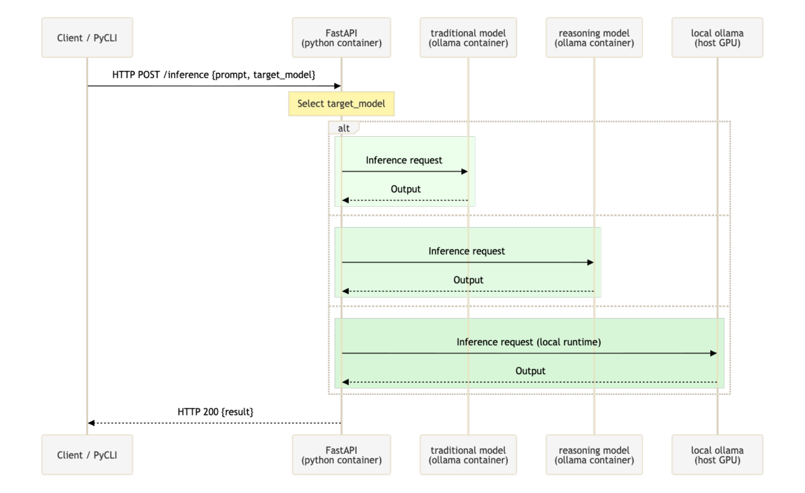

## Building Tool-Calling Patterns with OpenAI-Compatible LLMs and Ollama (FrontEnd)

This repo contains parts 7-9 (frontend focus) of the 3-week, 9-chapter course full-stack LLM tool-calling system course available here [ollama-tools-api](https://github.com/jrbrowning/ollama-tools-api).

## Course Overview

The latest chapter will always be merged into `main`.

`git pull origin main` and you'll be up to date with the latest code.

Each chapter is released as a separate branch (i.e., `07-chapter__react-typescript-shadcn-vite`) which you can reference at any point later.

### Week 1 & Week 2

This course intentially seperates content in to repos to model production seperation.  
Backend (handle the different API requests and interaction with the LLMs) and a Frontend (user interaction with the LLMs).

Backend course material is avaialble in the [course outline](https://github.com/jrbrowning/ollama-tools-api/discussions/8) repo.

### Week 3: Frontend Wire-up

This course material. Here's where we build something deployable, a TypeScript React UI that could actually ship to production.

But complexity comes back. Just because you can send SSE events doesn't mean your frontend knows what to do with them. How could you handle tool calls versus chat responses in your UI? We'll tackle these questions.

**Contents:** TypeScript React frontend with shadcn, TailwindCSS, and Zustand for state management.

## Workshop Architecture

This course leverages the Python ENV, Poetry dependency management, Ollama for local models, FastAPI for the gateway, and Docker for containerization architecture from the `ollama-tools-api` repository.

For ease of development, models are defined in a central `.env` file with variable names.

Models are referenced by their optimization types in the frontend for a more natural, usage-based invocation.

**Traditional models** are optimized for fast pattern completion.

**Reasoning models** are optimized for step-by-step logical problem solving.

### Stage Operation

Each LLM request-response is organized into a stage, with each stage supporting 6 modes of operation. Modes are grouped by completion and streaming, with their corresponding route paths:

| Completion Modes                 | Description                               | Route Path                                   |
| -------------------------------- | ----------------------------------------- | -------------------------------------------- |
| Chat Completion                  | Standard chat response                    | `/completion/chat`                           |
| Toolchain Completion             | Toolchain (tool-call) response            | `/completion/toolchain (tool-call strategy)` |
| Toolchain + Synthesis Completion | Toolchain with synthesis, single response | `/completion/toolchain (synthesis strategy)` |

| Streaming Modes                 | Description                                  | Route Path                               |
| ------------------------------- | -------------------------------------------- | ---------------------------------------- |
| Chat Streaming                  | Real-time chat response streaming            | `/stream/chat`                           |
| Toolchain Streaming             | Streaming toolchain (tool-call) response     | `/stream/toolchain (tool-call strategy)` |
| Toolchain + Synthesis Streaming | Toolchain with synthesis, streaming response | `/stream/toolchain (synthesis strategy)` |

### Why Local First?

This isn't about avoiding cloud services; cloud models are superior in many ways for tool calling. This course is about understanding the mechanics before you scale.

- **Privacy**: Your prompts, your tools, your data. All on your machine.
- **Cost**: Learn and experiment without burning through credits. Save them for production.
- **Speed**: No network latency during development. GPU-accelerated Ollama runs the best. CPU inference in Docker is slower, but works the same.
- **Control**: Debug, modify, break, fix. See exactly what's happening.

### A Note on Terminology

"Agent" means too many things to be useful here and is avoided intentionally.

To me, "agent" describes systems with different orchestration approaches:

- Computer use: Loop until task completion
- Assistant APIs: Manage conversation threads and state
- Framework agents: Route between chained LLM calls
- Autonomous systems: Recursively decompose and execute

Using precise terms clarifies what we're building: tool-calling with synthesis, not autonomous decision loops.

---

Disclaimer: This course is an independent project. I am not affiliated with, sponsored by, or endorsed by any of the companies or creators of the tools mentioned. All opinions and statements are my own and do not represent those of any company.
